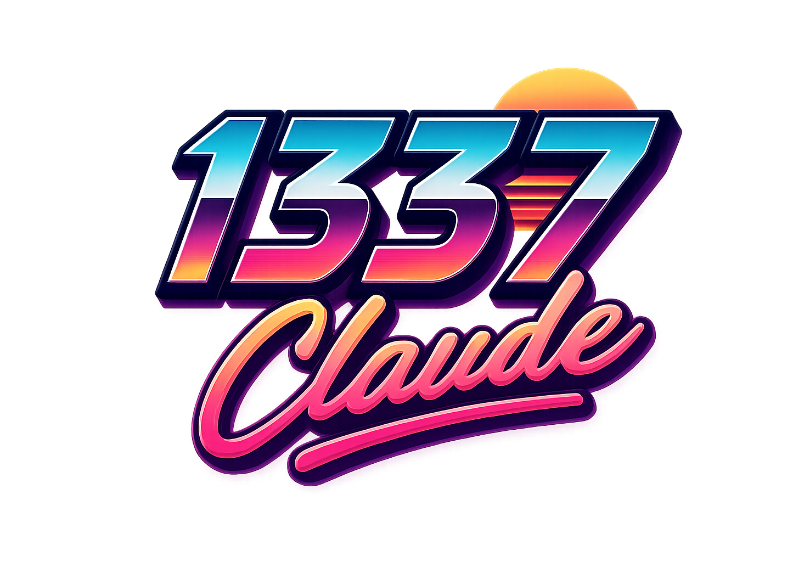

<p align="center">
  
</p>

> My personal experimentation repo for Claude Code. This is where I test new
> workflows and prompts, hooks, output styles, token optimization and anything
> else an agent might do differently.

A Claude Code plugin that adds eight output-style voices, read-only skills
that keep code lean, and two opt-in modes that route work to cheaper models.

## Why it exists

Claude Code sessions tend to over-build, drift from a plan, and burn an
expensive model on lookups a cheap one could handle. This plugin adds the
guardrails and the routing to fix that, without changing how you prompt.

## What's special

- **Eight voices, one engineer.** The persona changes how Claude talks, never
  the code it writes. See [the voices](docs/output-styles.md).
- **Read-only skills that cut, not add.** `/1337:review`, `/1337:audit`,
  `/1337:debt` and friends look for what to delete before anything gets
  built. See [skills](docs/skills.md).
- **Visual work without leaving the chat.** Ask for a logo, an SVG, a clip or
  a voice-over and it picks a priced OpenRouter model for you, ranked by
  [Jev](https://typesafe.ai), TypeSafe's decision model. See
  [visual generation](docs/visual-generation.md).
- **Terse by default.** Replies over budget get blocked and resent shorter.
  See [terse mode](docs/terse-mode.md).
- **Orchestrator mode.** The main session only plans; scouts, builders and
  checkers do the reading, coding and testing on cheaper models. See
  [orchestrator mode](docs/orchestrator-mode.md).
- **Tiered mode.** Jev picks Haiku, Sonnet or Opus per step, enforced by a
  hook, not just asked for. See [tiered mode](docs/tiered-mode.md).

## Install

```bash
claude plugin marketplace add dimitritholen/1337-claude
claude plugin install 1337@1337-claude
```

Or load it straight from a checkout:

```bash
claude --plugin-dir ~/projects/1337-claude
```

## More

- [The voices](docs/output-styles.md)
- [Skills](docs/skills.md)
- [Visual generation](docs/visual-generation.md)
- [Terse mode](docs/terse-mode.md)
- [Orchestrator mode](docs/orchestrator-mode.md)
- [Tiered mode](docs/tiered-mode.md)
- [Testing](docs/testing.md)
